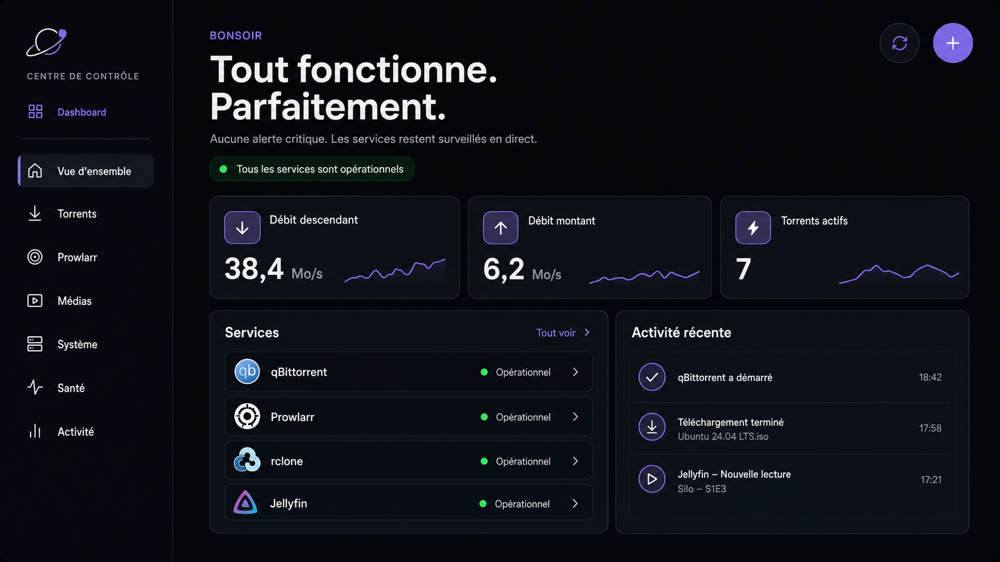

# Instructions d’implémentation — refonte visuelle complète du Dashboard

## Mission

Appliquer à l’ensemble du Dashboard le langage visuel de la maquette ci-dessous, puis modifier la vue d’ensemble du panneau Torrent pour en reproduire aussi fidèlement que possible la composition :



Fichier de référence absolu :

`docs/mockups/overview-without-media-space.png`

La grande carte « Votre espace média » doit disparaître de cette page. L’espace récupéré doit être réellement redistribué aux métriques, aux services et à l’activité récente. Il ne faut ni laisser un trou, ni remplacer la carte par un élément décoratif de taille comparable.

La maquette ne représente qu’une vue, mais elle définit le système visuel de toutes les autres : shell, sidebar, navigation, palette, typographie, rayons, bordures, densité, boutons, cartes, statuts et rythme d’espacement. Les autres pages doivent ressembler à des vues du même produit, pas à des outils indépendants partageant seulement quelques couleurs.

Ces instructions remplacent les passages de `MOCKUP_IMPLEMENTATION_INSTRUCTIONS.md` et `DESIGN_INSTRUCTIONS.md` qui imposent une carte de stockage comme point focal ou une présentation incompatible avec ce shell commun.

## Résultat attendu

À 1600 × 900 px, la page doit présenter :

1. une sidebar fixe à gauche ;
2. un en-tête éditorial en haut de la zone principale ;
3. trois métriques de largeur identique sur une seule ligne ;
4. une seconde ligne composée d’une carte Services occupant environ 64 % de la largeur et d’une carte Activité récente occupant environ 36 % ;
5. aucune carte, jauge, orbite ou information de capacité de stockage dans la vue d’ensemble.

La maquette est la source de vérité directe pour la vue d’ensemble et la source de vérité stylistique pour toutes les autres vues. Les données réelles, les libellés fonctionnels existants et les états d’erreur restent la source de vérité métier.

## Périmètre technique

Travailler en priorité dans :

- `torrent-panel/torrent_panel/static/index.html` ;
- `torrent-panel/torrent_panel/static/app.js` ;
- `torrent-panel/torrent_panel/static/css/home.css` ;
- `torrent-panel/torrent_panel/static/css/responsive.css` ;
- `torrent-panel/torrent_panel/static/storage.html` ;
- `torrent-panel/torrent_panel/static/media.html` ;
- `torrent-panel/torrent_panel/static/health.html` ;
- `torrent-panel/torrent_panel/static/activity.html` ;
- `torrent-panel/torrent_panel/static/console.css` ;
- `torrent-panel/torrent_panel/static/console.js` ;
- `prowlarr-panel/prowlarr_panel/static/index.html` ;
- `prowlarr-panel/prowlarr_panel/static/app.css` ;
- `prowlarr-panel/prowlarr_panel/static/css/responsive.css` ;
- `prowlarr-panel/prowlarr_panel/static/app.js` ;
- les composants communs dans `common/css/` lorsque la règle est réellement partagée ;
- les tests frontend concernés ;
- les bundles générés dans les dossiers `static/dist/` via `python3 torrent-panel/build.py` et `python3 prowlarr-panel/build.py`.

Ne pas modifier le backend ou les contrats API uniquement pour satisfaire la mise en page. Les données de stockage restent disponibles dans la page Système/Stockage. Ne casser aucune action, recherche, filtre, tri, onglet, dialogue ou navigation existante.

## Application obligatoire à toutes les vues

### Shell commun

Toutes les destinations de la navigation doivent employer visuellement le même shell que la maquette :

- même logo orbital et même bloc « CENTRE DE CONTRÔLE / Dashboard » ;
- même sidebar, largeur, espacement interne et séparation droite ;
- mêmes icônes SVG pour une destination donnée ;
- même ordre et mêmes libellés de navigation ;
- même traitement de l’élément actif : fond graphite, liseré violet et texte clair ;
- même zone de statut en bas de sidebar ;
- même largeur, padding et alignement de la zone principale ;
- même comportement compact entre 768 et 1023 px ;
- même navigation mobile sous 768 px.

Ne pas maintenir plusieurs implémentations visuellement divergentes de la sidebar. Extraire les règles partagées dans les CSS communs ou aligner rigoureusement les implémentations existantes. Une modification du shell doit être vérifiée sur chaque page.

Chaque vue possède dans la zone principale un en-tête cohérent :

```text
page-header
  eyebrow
  titre de page
  phrase descriptive courte
  état global facultatif
  actions de page à droite
page-content
```

Le très grand titre sur deux lignes est réservé à la vue d’ensemble. Les vues fonctionnelles utilisent un titre de 40 à 48 px sur desktop, avec une description de 16 à 18 px. Chaque écran ne doit avoir qu’une action primaire visuellement dominante.

### Vue Torrents

Adapter `#torrentsView` au shell de la maquette sans diminuer sa capacité opérationnelle :

- en-tête « Torrents » avec nombre affiché/total et action primaire « Ajouter un torrent » ;
- panneau d’ajout traité comme une carte secondaire repliable, directement sous l’en-tête ;
- filtres rapides en chips sobres ;
- recherche et filtres avancés dans une barre graphite distincte, non collée au tableau ;
- tableau dans une grande carte unique, bordure et rayon identiques aux cartes Services ;
- en-tête de tableau discret, lignes de 56 à 64 px, actions alignées à droite ;
- progression et statuts lisibles sans dépendre uniquement de la couleur ;
- barre d’actions groupées clairement séparée du contenu normal ;
- sur mobile, basculer vers les cartes structurées existantes plutôt que forcer un tableau horizontal illisible.

Ne pas afficher au-dessus de cette vue la rangée générique de cinq statistiques si elle concurrence l’en-tête ou répète les informations du tableau.

### Vue Prowlarr

Appliquer le shell commun à `prowlarr-panel` et conserver les quatre onglets fonctionnels.

- les onglets Indexeurs, Recherche, Applications et Santé sont une navigation secondaire compacte sous l’en-tête ;
- ils ne doivent jamais ressembler à une deuxième navigation principale ;
- l’onglet actif utilise l’accent violet, un fond léger et `aria-selected="true"` ;
- les résumés Prowlarr deviennent au maximum trois cartes métriques alignées, au format de la maquette ;
- les panneaux principaux utilisent les mêmes surfaces et rayons que Services/Activité.

Par onglet :

- **Indexeurs** : filtres sur une barre dédiée, tableau dense dans une seule carte, action « Tester tous » dans l’en-tête du panneau ;
- **Recherche** : formulaire principal clairement séparé des filtres de résultats, un seul bouton primaire « Rechercher », résultats dans une carte-tableau ;
- **Applications** : grille responsive de cartes homogènes, deux colonnes sur desktop si le contenu le permet ;
- **Santé** : grille 7/5 pour Alertes et Historique récent, puis empilement sous 1024 px.

### Vue Système / Stockage

Cette page est l’unique emplacement principal des informations retirées de l’accueil.

- en-tête « Système » ou « Stockage » conforme au shell commun ;
- action primaire « Actualiser rclone » ;
- première ligne de trois métriques utiles : capacité totale, utilisé, disponible ;
- seconde ligne facultative de deux métriques plus petites : vitesse rclone et erreurs ;
- grande carte « Montage et seuils » occupant environ 7 colonnes ;
- carte « Transferts actifs » occupant environ 5 colonnes ;
- une barre de progression de capacité est autorisée ici, mais pas l’ancienne illustration orbitale ;
- afficher le chemin surveillé et le statut de montage sans exposer de secret.

### Vue Médias

- en-tête « Médias » conforme au shell commun ;
- action primaire « Scanner Jellyfin » ;
- trois métriques prioritaires : serveur/version, lectures en cours, utilisateurs actifs ;
- les tâches ne deviennent une métrique séparée que si cela améliore la lecture ;
- grille principale 7/5 : « Derniers médias ajoutés » à gauche, « Tâches planifiées » à droite ;
- listes compactes avec icône, titre, méta-information et état textuel ;
- aucune affiche fictive, miniature inventée ou donnée codée en dur ;
- état vide utile avec action de relance lorsque cela est pertinent.

### Vue Santé

- en-tête « Santé du système » conforme au shell commun ;
- action primaire « Actualiser » ;
- trois métriques prioritaires : état global, opérationnels, incidents ;
- carte principale de vérifications sur 8 colonnes ;
- carte d’alertes corrélées sur 4 colonnes ;
- les états opérationnel, dégradé et indisponible associent icône, texte et couleur ;
- conserver le tableau sur desktop et le transformer en cartes structurées sur mobile ;
- l’absence d’alerte doit produire un état positif explicite, pas une zone vide.

### Vue Activité

- en-tête « Centre d’activité » conforme au shell commun ;
- action primaire « Actualiser » ;
- limiter la synthèse supérieure à trois métriques réellement prioritaires ;
- grande chronologie sur 8 colonnes ;
- notifications sur 4 colonnes ;
- simulations d’automatisation dans une grille secondaire sous les deux panneaux ;
- chaque événement présente service, action, résultat et date dans un ordre visuel stable ;
- les actions Acquitter/Rouvrir restent disponibles au clavier et ne sont pas uniquement visibles au survol.

### Dialogues, toasts et états transverses

Les dialogues de détail, confirmation et suppression font partie de la refonte :

- surface graphite, rayon 24 px, bordure commune, ombre sobre ;
- scrim noir de 50 à 60 % ;
- titre, description, actions secondaires puis action primaire/destructive ;
- fermeture avec Échap, focus piégé et retour du focus au déclencheur ;
- aucune action destructive déclenchée sans confirmation ;
- toasts placés de façon identique sur toutes les vues et annoncés avec `aria-live` sans voler le focus ;
- états chargement, vide, erreur et succès visuellement cohérents dans toute l’application.

## Structure DOM cible

Dans `#homeView` :

```text
overview-header
criticalAlerts (uniquement lorsqu’il existe des alertes)
overview-grid
  overviewMetrics
    metric-card × 3
  overview-lower-grid
    services-card
    activity-card
```

Supprimer du DOM de cette vue :

- `.overview-storage-card` ;
- `#storageTitle` ;
- `#storageSummary` ;
- `#storageVisualization`.

Supprimer également les références frontend devenues inutiles et l’appel à `renderStorageCard()` dans `renderHome()`. Ne pas conserver de sélecteurs orphelins ou de code mort spécifique à la visualisation orbitale. Ne pas supprimer la récupération des données de stockage si elle est encore utilisée ailleurs.

## Grille et proportions desktop

Utiliser une grille cohérente de 12 colonnes dans la zone principale.

### Sidebar

- largeur visuelle : environ 270 à 290 px à 1600 px ;
- séparation droite : bordure `1px` très discrète ;
- navigation verticale, icône SVG + libellé ;
- élément actif avec fond graphite, liseré violet à gauche et texte clair ;
- conserver la navigation et ses destinations actuelles ;
- ne pas introduire d’emoji ni d’icônes raster.

### Zone principale

- largeur fluide : tout l’espace restant ;
- padding horizontal : 56 à 64 px à 1600 px ;
- padding supérieur : 44 à 52 px ;
- largeur maximale non bloquante : la composition doit exploiter l’écran, sans bande vide artificielle ;
- espacement principal entre sections : 24 px ;
- espacement entre cartes : 16 à 20 px.

### En-tête

- sourcil violet en capitales, environ 14 px, graisse 600 ;
- titre sur deux lignes, environ 58 à 64 px à 1600 px, graisse 700, interligne proche de `1` ;
- paragraphe secondaire de 16 à 18 px, largeur maximale d’environ 680 px ;
- badge opérationnel juste sous le paragraphe, pas à droite du titre ;
- deux boutons icône ronds en haut à droite : actualiser puis ajouter ;
- cibles interactives d’au moins 44 × 44 px et `aria-label` explicite.

### Ligne des métriques

- trois cartes strictement égales, chacune sur quatre colonnes ;
- hauteur visuelle cible : 164 à 176 px ;
- padding : 22 à 24 px ;
- carte structurée avec icône à gauche, libellé, valeur forte et sparkline discrète ;
- la valeur est en chiffres tabulaires ;
- la sparkline ne doit pas dépasser un tiers de la largeur de la carte ;
- ne pas coder les valeurs en dur.

Utiliser les trois indicateurs actuellement disponibles dans le contrat API. Si un débit montant réel est exposé, reprendre exactement la maquette : débit descendant, débit montant, torrents actifs. Sinon, conserver les trois métriques actuelles — Débit, Torrents actifs, Indexeurs — sans inventer de donnée.

### Ligne Services / Activité

- grille sur 12 colonnes ;
- Services : 8 colonnes ;
- Activité récente : 4 colonnes ;
- les deux cartes commencent et finissent au même niveau ;
- hauteur minimale commune à 1600 × 900 : environ 350 px ;
- Services affiche quatre lignes compactes ;
- Activité affiche au maximum trois événements ;
- les contenus ne doivent pas créer de scroll interne ;
- si le contenu est plus court, la carte conserve sa hauteur sans centrer artificiellement les lignes.

## Direction visuelle

Réutiliser les tokens existants dans `common/css/tokens.css`. Ne pas créer un second thème parallèle.

Valeurs de référence :

```css
--bg: #07080b;
--surface: #101217;
--surface-2: #151821;
--text: #f5f5f7;
--muted: #a7abb5;
--text-subtle: #7e8491;
--border: rgba(255, 255, 255, 0.09);
--accent: #7c6cff;
--success: #5ee6a8;
--radius-card: 24px;
```

Règles :

- fond presque noir, jamais gris clair ;
- cartes graphite avec bordure fine ;
- ombres très discrètes ;
- violet réservé à la sélection, aux icônes, aux liens et aux sparklines ;
- vert réservé aux états opérationnels ;
- pas de gros halo, pas de néon, pas de glassmorphism appuyé ;
- pas de dégradé qui diminue la lisibilité ;
- même famille et même épaisseur de trait pour toutes les icônes SVG.

## Contenu et données dynamiques

Conserver les comportements actuels :

- le titre passe à « Une attention est requise. » en présence d’une alerte critique ;
- le badge global reflète l’état réel ;
- les métriques viennent de l’API et conservent leurs historiques ;
- les services affichent un statut textuel, pas seulement une couleur ;
- l’activité possède un état vide lisible et un état d’erreur récupérable ;
- les liens « Tout voir » restent fonctionnels ;
- les boutons Actualiser et Ajouter conservent leurs actions ;
- `aria-current` reste limité à l’entrée de navigation active.

Corriger l’orthographe visible au passage : utiliser « opérationnel » avec accent dans les textes français.

## Responsive obligatoire

Les breakpoints et le shell doivent être identiques sur toutes les destinations. Une page ne doit pas conserver une ancienne sidebar ou un ancien espacement parce qu’elle est servie par un autre panneau.

### ≥ 1440 px

- respecter la composition 3 métriques + grille 8/4 ;
- sidebar complète avec icônes et libellés ;
- aucune carte ne semble perdue dans une zone trop large.
- les vues à tableau conservent une largeur utile maximale et utilisent l’espace restant pour les colonnes importantes ;
- les grilles fonctionnelles utilisent selon leur contenu 8/4, 7/5 ou 6/6, mais jamais des largeurs arbitraires différentes d’une page à l’autre.

### 1024 à 1439 px

- sidebar compacte autorisée, conformément au comportement actuel ;
- trois métriques peuvent rester sur une ligne si chacune conserve au moins 230 px ;
- sinon passer à une grille 2 + 1, la troisième carte occupant la largeur disponible de façon intentionnelle ;
- Services/Activité peuvent passer en 7/5 ou s’empiler sous 1180 px si la lisibilité l’exige.
- les barres de filtres peuvent passer sur deux lignes sans réduire les champs sous une largeur utilisable ;
- les onglets Prowlarr restent visibles et utilisables au clavier.

### 768 à 1023 px

- sidebar rail d’icônes ou navigation compacte existante ;
- métriques sur une colonne ou deux colonnes selon la largeur réelle ;
- Services puis Activité sur une colonne ;
- conserver un ordre de lecture logique dans le DOM.
- toutes les grilles 8/4, 7/5 et 6/6 deviennent une colonne si leur contenu devient trop étroit ;
- les tableaux restent dans leur carte et utilisent soit un défilement local explicite, soit une transformation en cartes documentée.

### ≤ 767 px

- navigation mobile existante, sans défilement horizontal de la page ;
- titre entre 38 et 42 px ;
- boutons d’action sous le texte si nécessaire ;
- trois métriques empilées ;
- Services puis Activité empilés ;
- padding de carte : 20 px ;
- aucune troncature des statuts ou des valeurs importantes.
- formulaires et filtres sur une colonne ;
- tableaux Torrents, Prowlarr et Santé convertis en cartes structurées ;
- aucune barre d’action fixe ne masque la fin du contenu ;
- la navigation peut défiler horizontalement dans sa propre zone, mais la page entière ne doit jamais déborder.

Tester explicitement 1600 × 900, 1440 × 900, 1024 × 768, 768 × 1024 et 375 × 812.

## Accessibilité et interactions

- contraste WCAG AA : 4,5:1 pour le texte normal, 3:1 pour les grands textes et éléments graphiques ;
- focus clavier visible sur tous les liens et boutons ;
- cibles interactives d’au moins 44 × 44 px ;
- ordre de tabulation identique à l’ordre visuel ;
- le statut ne repose jamais uniquement sur la couleur ;
- les SVG décoratifs portent `aria-hidden="true"` ;
- les sparklines ont un résumé accessible ou sont décoratives si l’information existe déjà en texte ;
- transitions limitées à 150–250 ms sur `opacity`, `color`, `background-color`, `border-color` et `transform` ;
- respecter `prefers-reduced-motion: reduce` ;
- éviter tout déplacement de mise en page au chargement des données.

## Interdictions

Ne pas :

- réintroduire « Votre espace média » sous un autre nom ;
- afficher une jauge de stockage, une orbite, une planète ou une capacité disque sur l’accueil ;
- remplacer l’ancienne carte par une grande illustration ;
- conserver une colonne vide à gauche de `.overview-main` ;
- coder des valeurs métriques ou des statuts en dur ;
- ajouter un framework frontend ou une bibliothèque de graphiques pour trois sparklines simples ;
- réécrire toute l’application ;
- casser le système de préfixes publics des liens ;
- éditer uniquement les fichiers `dist` sans modifier les sources ;
- déclarer le travail terminé sans rendu navigateur ni comparaison visuelle.

## Méthode de validation imposée à l’IA

1. Lire entièrement les fichiers concernés avant toute modification.
2. Vérifier `git status` et préserver les changements utilisateur sans rapport avec la tâche.
3. Modifier les sources HTML/CSS/JS avec le minimum de portée nécessaire.
4. Mettre à jour les tests frontend pour figer l’absence de la carte stockage, la nouvelle structure et la cohérence du shell sur toutes les pages.
5. Exécuter `python3 torrent-panel/build.py` et `python3 prowlarr-panel/build.py`.
6. Exécuter les tests frontend et backend des panneaux Torrent et Prowlarr.
7. Lancer l’application avec des fixtures représentatives.
8. Capturer Vue d’ensemble, Torrents, chaque onglet Prowlarr, Système, Médias, Santé et Activité à 1600 px.
9. Capturer également chaque destination principale à 1024 px et 375 px ; compléter à 1440 px et 768 px lorsqu’un breakpoint présente un doute.
10. Comparer la vue d’ensemble côte à côte avec `docs/mockups/overview-without-media-space.png`.
11. Comparer les autres pages à la vue d’ensemble implémentée pour vérifier sidebar, largeur de contenu, en-tête, tokens, cartes et densité.
12. Itérer sur les proportions, alignements, hauteurs, espacements et tailles typographiques jusqu’à obtenir une ressemblance claire et une cohérence inter-pages évidente.
13. Vérifier au clavier, avec `prefers-reduced-motion`, et sans erreur console sur chaque famille de page.
14. Fournir un récapitulatif des fichiers modifiés, tests exécutés, captures contrôlées et écarts résiduels éventuels.

## Tests d’acceptation

Le travail est accepté uniquement si toutes les affirmations suivantes sont vraies :

- le texte « Votre espace média » n’existe plus dans le HTML ni dans le rendu de la vue d’ensemble ;
- aucun élément de stockage n’occupe l’ancien emplacement ;
- les trois métriques remplissent la première ligne de contenu ;
- Services et Activité remplissent ensemble la seconde ligne avec une proportion proche de 2/3–1/3 ;
- les cartes Services et Activité sont alignées en haut et en bas sur desktop ;
- les données affichées proviennent toujours des réponses API ;
- les alertes et états dégradés restent visibles et compréhensibles ;
- il n’existe aucun débordement horizontal aux cinq tailles testées ;
- les autres vues et actions existantes n’ont pas régressé ;
- les bundles `dist` correspondent exactement aux sources ;
- la page servie après build ressemble visuellement à la maquette de référence.
- Vue d’ensemble, Torrents, Prowlarr, Système, Médias, Santé et Activité partagent exactement le même shell visuel ;
- le logo, la navigation, les icônes, l’état actif et le bloc de statut ne changent pas de géométrie entre les pages à largeur identique ;
- chaque vue possède un en-tête, une hiérarchie et une action primaire cohérents ;
- les tableaux, formulaires, onglets, listes, dialogues et toasts utilisent les mêmes tokens et états interactifs ;
- chaque destination est validée à 1600 px, 1024 px et 375 px sans débordement ni contenu masqué ;
- les filtres, tris, recherches, actions, onglets et dialogues existants fonctionnent toujours.

## Prompt prêt à copier dans une autre IA

```text
Implémente scrupuleusement la refonte complète décrite dans
OVERVIEW_REDESIGN_IMPLEMENTATION_INSTRUCTIONS.md.

La référence visuelle obligatoire est :
docs/mockups/overview-without-media-space.png

Commence par lire entièrement les instructions, puis inspecte le code existant et
git status. Préserve les fonctionnalités et les changements utilisateur hors périmètre.
La maquette est la référence directe pour la vue d’ensemble et définit le langage
visuel obligatoire de toutes les autres vues : Torrents, chaque onglet Prowlarr,
Système/Stockage, Médias, Santé et Activité, ainsi que les dialogues et états transverses.

Ne réinterprète pas la composition de l’accueil : retire réellement la carte « Votre
espace média » et redistribue sa surface selon les proportions documentées. Sur les
autres pages, reprends scrupuleusement le même shell, la sidebar, les en-têtes, les
tokens, les cartes et la densité, puis suis la composition propre à chaque vue décrite
dans le document. Ne transforme pas toutes les pages en copies fonctionnelles de
l’accueil et ne perds aucune fonctionnalité existante.

Conserve les données dynamiques, reconstruis les bundles des deux panneaux, exécute
les tests et valide visuellement toutes les destinations aux viewports demandés. Itère
tant que l’accueil ne ressemble pas clairement à la maquette et que les autres pages
ne paraissent pas appartenir exactement au même produit. Ne t’arrête pas après une
simple modification du HTML/CSS : le rendu navigateur de chaque vue et les tests
d’acceptation sont obligatoires.
```
